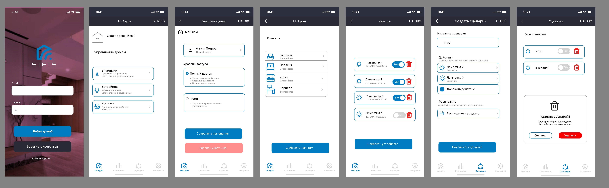

# Прототип STETS

В рамках проекта разработан прототип мобильного приложения STETS из 26 связанных фреймов.

Прототип охватывает основные пользовательские сценарии системы и может быть запущен в интерактивном режиме непосредственно из Figma.

## Прототип в Figma

[Открыть страницу с прототипом в Figma](https://www.figma.com/design/qUV5tVJHjnNurNxrpYP0Wz/%D0%94%D0%B8%D0%B7%D0%B0%D0%B9%D0%BD-%D1%81%D0%B8%D1%81%D1%82%D0%B5%D0%BC%D0%B0-Stets?node-id=4-581)

## Основные сценарии

- регистрация и авторизация;
- управление домом;
- управление участниками и правами доступа;
- работа с комнатами;
- управление устройствами;
- создание и управление сценариями автоматизации.

## Превью

Ниже представлена часть экранов прототипа.

